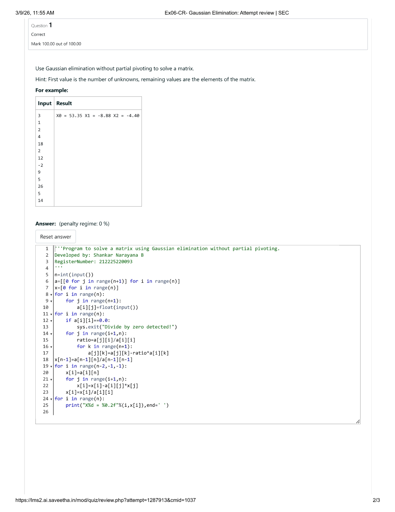
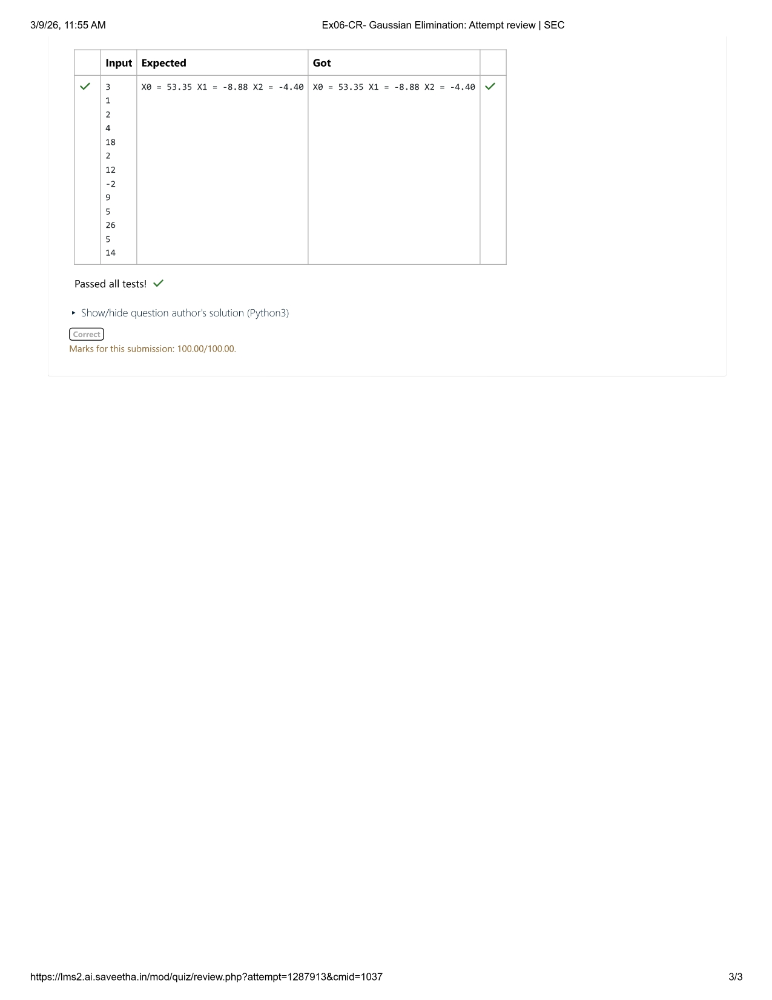

# Gaussian Elimination

## AIM:
To write a program to find the solution of a matrix using Gaussian Elimination.

## Equipments Required:
1. Hardware – PCs
2. Anaconda – Python 3.7 Installation / Moodle-Code Runner

## Algorithm
1. Read the number of unknowns and the elements of the augmented matrix from the input.

2. Apply forward elimination to convert the matrix into an upper triangular form by eliminating the elements below the pivot.

3. Perform back substitution starting from the last equation to calculate the values of the unknown variables.

4. Print the values of the variables (X0, X1, X2, …) as the final solution.

## Program:
```
'''Program to solve a matrix using Gaussian elimination without partial pivoting.
Developed by: Shankar Narayana B
RegisterNumber: 212225220093
'''
n=int(input())
a=[[0 for j in range(n+1)] for i in range(n)]
x=[0 for i in range(n)]
for i in range(n):
    for j in range(n+1):
        a[i][j]=float(input())
for i in range(n):
    if a[i][i]==0.0:
        sys.exit("Divide by zero detected!")
    for j in range(i+1,n):
        ratio=a[j][i]/a[i][i]
        for k in range(n+1):
            a[j][k]=a[j][k]-ratio*a[i][k]
x[n-1]=a[n-1][n]/a[n-1][n-1]
for i in range(n-2,-1,-1):
    x[i]=a[i][n]
    for j in range(i+1,n):
        x[i]=x[i]-a[i][j]*x[j]
    x[i]=x[i]/a[i][i]
for i in range(n):
    print("X%d = %0.2f"%(i,x[i]),end=' ')
    

```

## Output:






## Result:
Thus the program to find the solution of a matrix using Gaussian Elimination is written and verified using python programming.

